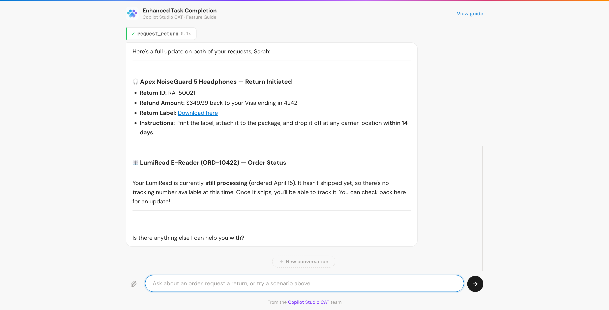

# Enhanced Task Completion - Sample

An e-commerce customer service demo for **Enhanced Task Completion** in Microsoft Copilot Studio. Two agents chain 9 tools across two inline MCP connectors. Everything runs inside the Power Platform, no external servers needed.

## What's in the solution

| Component | Description |
|---|---|
| **ETC - Order Management** | Primary agent. Searches orders, views details, tracks shipments, manages returns. Delegates warehouse queries to the connected agent. |
| **ETC - Warehouse Management** | Connected agent for inventory and fulfillment. Checks stock, tracks fulfillment pipeline, finds alternatives, looks up restock dates. |
| **Order Management MCP** | Custom connector with inline MCP server (C# script). 5 tools with mock e-commerce data. |
| **Warehouse MCP** | Custom connector with inline MCP server (C# script). 4 tools with mock warehouse data. |

## Quick start

### 1. Import the solution

1. Go to [make.powerapps.com](https://make.powerapps.com) and select your environment
2. Navigate to **Solutions** > **Import solution**
3. Upload `solution/EnhancedTaskCompletionDemo.zip`
4. Click **Next**, then **Import**

### 2. Create connections

After import, go to **Custom connectors** in the left nav. For each MCP connector (**Order Management MCP** and **Warehouse MCP**), click **Create connection**. No auth needed, just click **Create**.

### 3. Publish agents

In Copilot Studio, open each agent (**ETC - Order Management** and **ETC - Warehouse Management**) and click **Publish**.

### 4. Test

Open **ETC - Order Management** in Copilot Studio and try the prompts in the test pane. The [scenario guide](https://microsoft.github.io/enhanced-task-completion/#scenarios) has four walkthroughs with copyable prompts covering multi-tool orchestration, conversational guidance, connected agents, and file processing.

## Chat UI (optional)

The Copilot Studio test pane is all you need to try the scenarios above. The chat UI is an optional add-on for demos and presentations where you want to show the agent to people who don't have access to Copilot Studio (non-makers, stakeholders, external audiences).

The `chat-ui-lite/` folder contains a lightweight web frontend built with Vite and the [Copilot Studio JS SDK](https://www.npmjs.com/package/@microsoft/agents-copilotstudio-client). It renders reasoning steps, tool calls, and file uploads inline, giving visibility into how ETC orchestrates behind the scenes.



### 1. Create an Entra ID App Registration

1. Go to the [Azure portal](https://portal.azure.com) > **Microsoft Entra ID** > **App registrations** > **New registration**
2. Name it anything (e.g., "ETC Chat UI")
3. Under **Supported account types**, select **Accounts in this organizational directory only**
4. Under **Redirect URI**, select **Single-page application (SPA)** and enter `http://localhost:5173`
5. Click **Register**
6. Copy the **Application (client) ID** and **Directory (tenant) ID** from the Overview page

### 2. Configure API permissions

1. In your app registration, go to **API permissions** > **Add a permission**
2. Select the **APIs my organization uses** tab
3. Search for **Power Platform API** and select it
4. Under **Delegated permissions**, check `CopilotStudio.Copilots.Invoke`
5. Click **Add permissions**
6. Optionally, click **Grant admin consent** to skip per-user consent prompts

> If **Power Platform API** doesn't appear, it may need to be registered with your tenant first. See the [Copilot Studio WebChat sample](https://github.com/microsoft/Agents/tree/main/samples/nodejs/copilotstudio-webclient) for details.

### 3. Get your environment ID and agent schema name

Make sure your agent is published first (see Quick start step 3 above). Then:

1. In Copilot Studio, open your agent
2. Go to **Settings** > **Advanced** > **Metadata**
3. Copy the **Schema name** (e.g., `cr26e_orderManagement`)
4. Copy the **Environment ID** (also visible in the URL: `environments/{environment-id}/...`)

### 4. Run the chat UI

```bash
cd chat-ui-lite
cp .env.sample .env
```

Edit `.env` with your values:

```
VITE_ENVIRONMENT_ID=6cc0c98e-3fe6-e0d5-8eba-ba51c9da1d13
VITE_AGENT_SCHEMA=cr26e_orderManagement
VITE_TENANT_ID=8a235459-...
VITE_CLIENT_ID=abc12345-...
```

Then:

```bash
npm install
npm run dev
```

Open `http://localhost:5173` in your browser. On first message, a popup will prompt you to sign in with your Microsoft account.

## How it works

The connectors use the [Power MCP Template](https://github.com/troystaylor/SharingIsCaring/tree/main/Connector-Code/Power%20MCP%20Template) pattern: a C# script inside each custom connector implements a full MCP server. When Copilot Studio calls the connector, the script handles `initialize`, `tools/list`, and `tools/call` with static mock data. No external servers, no dev tunnels, no Node.js.

The connector source is in `connectors/` for reference:

| Connector | Script | Tools |
|---|---|---|
| Order Management MCP | [`connectors/order-management-inline/script.csx`](connectors/order-management-inline/script.csx) | search_orders, get_order, get_shipment, request_return, get_return_status |
| Warehouse MCP | [`connectors/warehouse-inline/script.csx`](connectors/warehouse-inline/script.csx) | check_stock, get_fulfillment_status, find_alternatives, get_restock_date |

Based on [Power MCP Template v2.1](https://github.com/troystaylor/SharingIsCaring/tree/main/Connector-Code/Power%20MCP%20Template) by Troy Taylor (MIT License).

## Prerequisites

- A Power Platform environment with Copilot Studio on the **Early Release** channel (as of April 2026, Enhanced Task Completion is only available in Early Release environments)
- Maker or Admin role in the target environment
